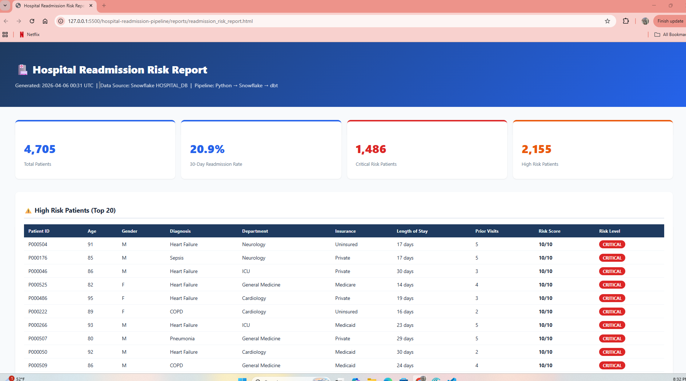

# Hospital Readmission Risk Pipeline

An automated data engineering pipeline that ingests patient discharge records, validates data quality, calculates 30-day readmission risk scores using clinical indicators, and auto-generates a styled HTML risk report — replacing hours of manual spreadsheet work with a fully automated daily pipeline.

> **Real Problem Solved:** Hospitals are financially penalized by Medicare under the Hospital Readmissions Reduction Program (HRRP) for high 30-day readmission rates. This pipeline automatically identifies high-risk patients so clinical teams can intervene early — without touching a single spreadsheet.

---

## Tech Stack

| Layer | Tool | Purpose |
|-------|------|---------|
| Data Generation | Python + Faker | Realistic synthetic patient discharge data |
| Ingestion | Python + Pandas | Validate, clean, flag bad records |
| Warehouse | Snowflake | Store raw and transformed patient data |
| Transformation | dbt Core | Risk indicators + aggregations |
| Testing | dbt Tests | 16 automated data quality tests |
| Reporting | Python + HTML | Auto-generated daily risk report |
| Version Control | GitHub | Full project source code |

---

## Pipeline Architecture

```
Synthetic Patient Discharge Data (5,000 records)
        ↓
Python Ingestion Script
(validate, clean, flag nulls & invalid records)
        ↓
Snowflake — RAW_PATIENT_DISCHARGES (4,705 clean records)
        ↓
dbt Staging — stg_patient_discharges
(cast types, filter bad records)
        ↓
dbt Intermediate — int_patient_risk_factors
(age group, LOS category, prior visit flag, composite risk score 1-10)
        ↓
dbt Marts
├── mart_readmission_risk      → patient-level risk with CRITICAL/HIGH/MEDIUM/LOW
├── mart_diagnosis_summary     → readmission rate by diagnosis
└── mart_department_summary    → risk breakdown by department
        ↓
Python Report Generator
(query Snowflake → auto-generate HTML report)
        ↓
reports/readmission_risk_report.html
```

---

## Risk Scoring Logic

Each patient receives a composite risk score from 1–10 based on:

| Factor | Score Contribution |
|--------|-------------------|
| Age 80+ | +3 |
| Age 65-79 | +2 |
| Length of Stay 14+ days or 1-2 days | +2 |
| Prior 30-day visits ≥ 2 | +2 |
| High-risk diagnosis (Heart Failure, COPD, Pneumonia, Sepsis) | +3 |
| Medium-risk diagnosis (Stroke, Kidney Disease, Arrhythmia) | +2 |

**Risk Levels:**
- 🔴 **CRITICAL** — Score 8-10
- 🟠 **HIGH** — Score 6-7
- 🟡 **MEDIUM** — Score 4-5
- 🟢 **LOW** — Score 1-3

---

## Key Results

- **5,000** patient records generated
- **295** bad records flagged and removed (null age, null diagnosis, invalid LOS)
- **4,705** clean records loaded into Snowflake
- **20.9%** 30-day readmission rate
- **1,486** critical risk patients identified
- **2,155** high risk patients identified
- **16/16** dbt data quality tests passing

---

## HTML Report Preview



The auto-generated report includes:
1. **KPI Summary** — total patients, readmission rate, critical/high risk counts
2. **High Risk Patients Table** — top 20 patients ranked by risk score
3. **Readmission by Diagnosis** — which diagnoses drive the most readmissions
4. **Risk by Department** — which departments have the highest risk patients

---

## Project Structure

```
hospital-readmission-pipeline/
├── ingestion/
│   ├── generate_data.py       # Synthetic patient data generator
│   └── ingest.py              # Validation, cleaning, Snowflake load
├── dbt_project/
│   └── hospital_dbt/
│       ├── models/
│       │   ├── staging/
│       │   │   └── stg_patient_discharges.sql
│       │   ├── intermediate/
│       │   │   └── int_patient_risk_factors.sql
│       │   └── marts/
│       │       ├── mart_readmission_risk.sql
│       │       ├── mart_diagnosis_summary.sql
│       │       └── mart_department_summary.sql
│       └── schema.yml
├── reports/
│   ├── generate_report.py     # HTML report generator
│   └── readmission_risk_report.html
├── images/
│   └── report.png
├── .gitignore
└── README.md
```

---

## How to Run

```bash
# 1. Clone the repo
git clone https://github.com/NitishChowdaryK/hospital-readmission-pipeline.git
cd hospital-readmission-pipeline

# 2. Create and activate virtual environment
python -m venv venv
venv\Scripts\activate

# 3. Install dependencies
pip install pandas faker "snowflake-connector-python[pandas]" dbt-snowflake

# 4. Generate synthetic patient data
python ingestion/generate_data.py

# 5. Set your Snowflake credentials in ingestion/ingest.py and reports/generate_report.py

# 6. Create Snowflake database
# Run in Snowflake: CREATE DATABASE HOSPITAL_DB; CREATE SCHEMA HOSPITAL_DB.READMISSION;

# 7. Run ingestion pipeline
python ingestion/ingest.py

# 8. Run dbt models
cd dbt_project/hospital_dbt
dbt run
dbt test

# 9. Generate HTML report
cd ../..
python reports/generate_report.py

# 10. Open the report
# Open reports/readmission_risk_report.html in your browser
```

---

## dbt Test Results

```
PASS=16  WARN=0  ERROR=0  TOTAL=16
```

Tests cover: not_null, unique, accepted_values across all models

---

## Skills Demonstrated
- Synthetic healthcare data generation with realistic dirty data
- Python-based data validation and quality flagging
- Bulk loading to Snowflake using snowflake-connector-python
- dbt multi-layer transformation (Staging → Intermediate → Marts)
- Clinical risk scoring logic using SQL CASE expressions
- Automated HTML report generation from live Snowflake data
- End-to-end pipeline solving a real federally regulated healthcare problem